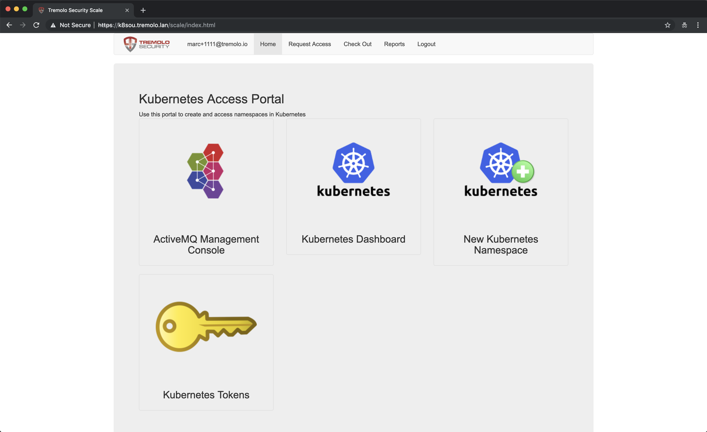
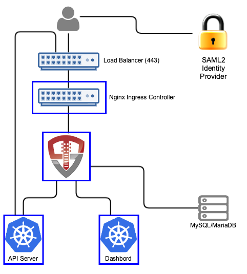

# Orchestra For Kubernetes - SAML2


Orchestra is an automation portal for Kubernetes built on OpenUnison.  Orchestra integrates a user's identity into Kubernetes enabling:

1. SSO between the API server and your LDAP infrastructure
2. SSO with the Kubernetes Dashboard
3. Self service access to existing Namespaces
4. Self service creation of new Namespaces
5. Workflows for automating access approvals without getting system administrators involved
6. Built in self service reporting



When a user accesses Kubernetes using Orchestra, they'll access both the self service portal and the dashboard through OpenUnison's reverse proxy (instead of directly via an ingress).  OpenUnison will inject the user's identity into each request, allowing the dashboard to act on their behalf.

Orchestra stores all Kubernetes access information as a groups inside of a relational database, as opposed to a group in an external directory.  OpenUnison will create the appropriate Roles and RoleBindings to allow for the access.




When a user accesses Kubernetes using OpenUnison, they'll access both te self service portal and the dashboard through OpenUnison (instead of directly via an ingress).  OpenUnison will inject the user's identity into each request, allowing the dashboard to act on their behalf.

The OpenUnison deployment stores all Kubernetes access information as a groups inside of a relational database, as opposed to a group in an external directory.  OpenUnison will create the appropriate Roles and RoleBindings to allow for the access.

# Roles Supported

## Cluster

1.  Administration - Full cluster management access

## Namespace

1.  Administrators - All operations inside of a namespace
2.  Viewers - Can view contents of a namespace (except `Secret`s), but can not make changes

## Non-Kubernetes

1.  System Approver - Able to approve access to roles specific to OpenUnison
2.  Auditor - Able to view audit reports, but not request projects or approve access

# Deployment

## What You Need To Start

Prior to deploying OpenUnison you will need:

1. Kubernetes 1.10 or higher
2. The Nginx Ingress Controler deployed (https://kubernetes.github.io/ingress-nginx/deploy/)
3. A MySQL or MariaDB Database
4. The SAML2 Metadata for your identity provider
5. An SMTP server for sending notifications
6. Deploy the dashboard to your cluster
7. helm 3.0+

The deployment is a four step process:

1. Add Tremolo Security's Helm repo to your own
2. Deploy the OpenUnison Operator
3. Create a secret for your keystore password
4. Deploy OpenUnison

## Add Tremolo Security's Helm Repo

```
helm repo add tremolo https://nexus.tremolo.io/repository/helm/
helm repo update
```

## Deploy The OpenUnison Operator

Create your namespace
```
kubectl create ns openunison
```

Deploy the operator
```
helm install openunison tremolo/openunison-operator --namespace openunison
```

Wait for the operator pod to be available
```
watch kubectl get pods -n openunison
```

## Create A Secret For Your Active Directory Password

Create a secret in the `openunison` namespace:

```
apiVersion: v1
type: Opaque
metadata:
  name: orchestra-secrets-source
  namespace: openunison
data:
  K8S_DB_SECRET: aW0gYSBzZWNyZXQ=
  SMTP_PASSWORD: aW0gYSBzZWNyZXQ=
  OU_JDBC_PASSWORD: aW0gYSBzZWNyZXQ=
  unisonKeystorePassword: aW0gYSBzZWNyZXQ=
kind: Secret
```

| Property | Description |
| -------- | ----------- |
| unisonKeystorePassword | The password for OpenUnison's keystore, should NOT contain an ampersand (`&`) |
| K8S_DB_SECRET | A random string of characters used to secure the SSO process with the dashboard.  This should be long and random, with no ampersands (`&`) |
| OU_JDBC_PASSWORD | The password for accessing the database |
| SMTP_PASSWORD | Password for accessing the SMTP server (may be blank) |

## Deploy OpenUnison

Copy `values.yaml` (https://raw.githubusercontent.com/OpenUnison/helm-charts/master/openunison-k8s-saml2/values.yaml) and update as appropriate:

| Property | Description |
| -------- | ----------- |
| network.openunison_host | The host name for OpenUnison.  This is what user's will put into their browser to login to Kubernetes |
| network.dashboard_host | The host name for the dashboard.  This is what users will put into the browser to access to the dashboard. **NOTE:** `network.openunison_host` and `network.dashboard_host` Both `network.openunison_host` and `network.dashboard_host` **MUST** point to OpenUnison |
| network.api_server_host | The host name to use for the api server reverse proxy.  This is what `kubectl` will interact with to access your cluster. **NOTE:** `network.openunison_host` and `network.dashboard_host` |
| network.k8s_url | The URL for the Kubernetes API server | 
| network.session_inactivity_timeout_seconds | The number of seconds of inactivity before the session is terminated, also the length of the refresh token's session |
| saml.idp_url | The url to your identity provider's saml2 metadata.  If not using a metadata url, set this to an empty string `""` |
| saml.metadata_xml_b64 | Base64 encoded metadata.  Will only be used if `idp_url` is an empty string |
| cert_template.ou | The `OU` attribute for the forward facing certificate |
| cert_template.o | The `O` attribute for the forward facing certificate |
| cert_template.l | The `L` attribute for the forward facing certificate |
| cert_template.st | The `ST` attribute for the forward facing certificate |
| cert_template.c | The `C` attribute for the forward facing certificate |
| certs.use_k8s_cm  | Tells the deployment system if you should use k8s' built in certificate manager.  If your distribution doesn't support this (such as Canonical and Rancher), set this to false |
| myvd_config_path | The path to the MyVD configuration file, unless being customized, use `WEB-INF/myvd.conf` |
| dashboard.namespace | The namespace for the dashboard.  For the 1.x dashboard this is `kube-system`, for the 2.x dashboard this is `kubernetes-dashboard` |
| dashboard.cert_name | The name of the secret in the dashboard's namespace that stores the certificate for the dashboard |
| dashboard.label | The label of the dashboard pod, this is used to delete the pod once new certificates are generated |
| dashboard.service_name | The name of the service object for the dashboard |
| k8s_cluster_name | The name of the cluster to use in the `./kube-config`.  Defaults to `kubernetes` |
| image | The name of the image to use |
| enable_impersonation | If `true`, OpenUnison will run in impersonation mode.  Instead of OpenUnison being integrated with Kubernetes via OIDC, OpenUnison will be a reverse proxy and impersonate users.  This is useful with cloud deployments where oidc is not an option |
| monitoring.prometheus_service_account | The prometheus service account to authorize access to the /monitoring endpoint |
| database.hibernate_dialect | Hibernate dialect for accessing the database.  Unless customizing for a different database do not change |
| database.quartz_dialect | Dialect used by the Quartz Scheduler.  Unless customizing for a different database do not change  |
| database.driver | JDBC driver for accessing the database.  Unless customizing for a different database do not change |
| database.url | The URL for accessing the database |
| database.user | The user for accessing the database |
| database.validation | A query for validating database connections/ Unless customizing for a different database do not change |
| smtp.host | Host for an email server to send notifications |
| smtp.port | Port for an email server to send notifications |
| smtp.user | Username for accessing the SMTP server (may be blank) |
| smtp.from | The email address that messages from OpenUnison are addressed from |
| smtp.tls | true or false, depending if SMTP should use start tls |

Additionally, if your SAML2 identity provider uses a self signed certificate in its chain, add its base 64 encoded PEM certificate to your values under `trusted_certs` for `pem_b64`.  This will allow OpenUnison to talk to your identity provider to retrieve metadata using TLS.

Finally, run the helm chart:

`helm install orchestra tremolo/openunison-k8s-saml2 --namespace openunison -f /path/to/values.yaml`

## Complete Integrate with your Identity Provider

Orchestra's metadata is published at `/auth/forms/saml2_rp_metadata.jsp` off of your `OU_HOST` configuration option.  So if `OU_HOST` is k8sou.tremolo.lan then your metadata URL is `https://k8sou.tremolo.lan/auth/forms/saml2_rp_metadata.jsp`.  Import it into your identity provider and add the following attributes to the assertion so OpenUnison knows how the logged in uers is:

| Attribute Name | Active Directory Attribute | Description |
| -------------- | -------------------------- | ----------- |
| uid            | samAccountName             | User's login id |
| givenName      | givenName                  | User's first name |
| sn             | sn                         | User's last name |
| mail           | mail                       | User's email address |

If using Active Directory Federation Services, you can use the following claims transformation rule:
```
c:[Type == "http://schemas.microsoft.com/ws/2008/06/identity/claims/windowsaccountname", Issuer == "AD AUTHORITY"]
 => issue(store = "Active Directory", types = ("http://schemas.xmlsoap.org/ws/2005/05/identity/claims/nameidentifier", "uid", "givenName", "sn", "mail"), query = ";sAMAccountName,sAMAccountName,givenName,sn,mail;{0}", param = c.Value);
```

Once the metadata is imported and the attributes are added, you are ready to login to Orchestra.

## Complete SSO Integration with Kubernetes

If using impersonation, you can skip this section.  Run `kubectl describe configmap api-server-config -n openunison` to get the SSO integration artifacts.  The output will give you both the API server flags that need to be configured on your API servers.  The certificate that needs to be trusted is in the `ou-tls-certificate` secret in the `openunison` namespace.

## First Login to Orchestra

At this point you should be able to login to OpenUnison using the host specified in  the `OU_HOST` of your properties.  Once you are logged in, logout.  Users are created in the database "just-in-time", meaning that once you login the data representing your user is created inside of the database deployed for Orchestra.

## Create First Administrator

The user you logged in as is currently unprivileged.  In order for other users to login and begin requesting access to projects this first user must be enabled as an approver.  Login to the MySQL database deployed for Orchestra and execute the following SQL:

```sql
insert into userGroups (userId,groupId) values (2,1);
```

This will add the administrator group to your user.  Logout of OpenUnison and log back in.

## Self Request & Approve Cluster Administrator

Once SSO is enabled in the next step, you'll need a cluster administrator to be able to perform cluster level operations:

1.  Login to Orchestra
2.  Click on "Request Access" in the title bar
3.  Click on "Kubernetes Administration"
4.  Click "Add To Cart" next to "Cluster Administrator"
5.  Next to "Check Out" in the title bar you'll see a red `1`, click on "Check Out"
6.  For "Supply Reason", give a reason like "Initial user" and click "Submit Request"
7.  Since you are the only approver refresh OpenUnison, you will see a red `1` next to "Open Approvals".  Click on "Open Approvals"
8. Click "Review" next to your email address
9. Specify "Initial user" for the "Justification" and click "Approve"
10. Click on "Confirm Approval"

At this point you will be provisioned to the `k8s-cluster-administrators` group in the database that has a RoleBinding to the `cluster-admin` Role.  Logout of Orchestra and log back in.  If you click on your email address in the upper left, you'll see that you have the Role `k8s-cluster-administrators`.  

# Using Your Own Certificates

If you want to integrate your own certificates see our wiki entry - https://github.com/TremoloSecurity/OpenUnison/wiki/troubleshooting#how-do-i-change-openunisons-certificates

# Monitoring OpenUnison

This deployment comes with a `/metrics` endpoint for monitoring.  For details on how to integrate it into a Prometheus stack - https://github.com/TremoloSecurity/OpenUnison/wiki/troubleshooting#how-do-i-monitor-openunison-with-prometheus.

# Trouble Shooting Help

Please take a look at https://github.com/TremoloSecurity/OpenUnison/wiki/troubleshooting if you're running into issues.  If there isn't an entry there that takes care of your issue, please open an issue on this repo.

# Customizing Orchestra

To customize Orchestra - https://github.com/TremoloSecurity/OpenUnison/wiki/troubleshooting#customizing-orchestra

# Whats next?
Users can now login to create namespaces, request access to cluster admin or request access to other clusters.

Now you can begin mapping OpenUnison's capabilities to your business and compliance needs.  For instance you can add multi-factor authentication with TOTP or U2F, Create privileged workflows for onboarding, scheduled workflows that will deprovision users, etc.